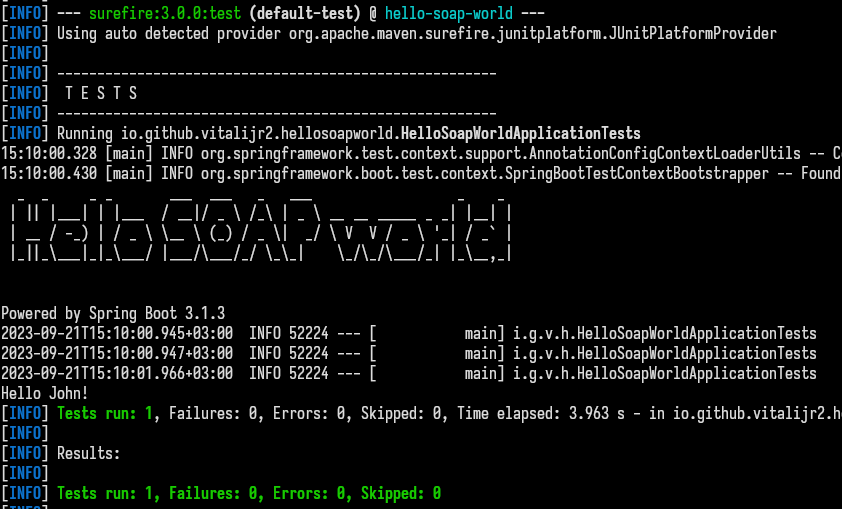
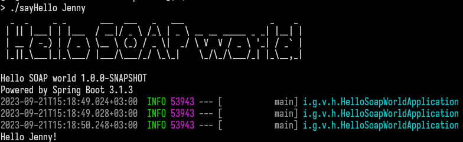

# Hello SOAP world

This repository contains the source of the Spring Boot client application that consumes
one of web services from [Learn web services][learnwebservices] site.

## Say Hello web service

The web service accepts a name, and gives back a welcome message.

The definition file of the web services ia available locally as [hello.wsdl][local-wsdl]
as well as [on site][on-site-wsdl].

### Build

With Maven Wrapper you can build it by command

```bash
./mvnw
```

also it runs tests like this:


### Run

Run it by command

```bash
./sayHello Jenny
```


[learnwebservices]: http://learnwebservices.com

[local-wsdl]: wsdl/hello.wsdl

[on-site-wsdl]: https://apps.learnwebservices.com/services/hello?WSDL